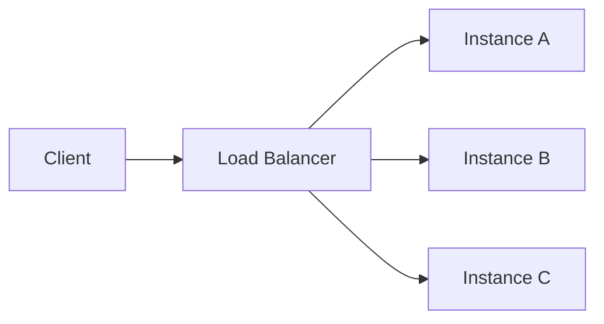

# Drawing a canvas

An ```html fenced block in your reply is not a listing. It runs — a real page, sandboxed, sitting
in the conversation where a diagram would be. Animation, interaction, a thing they can drag.

This exists because some explanations are about *change over time*, and a paragraph describing
motion is a worse version of the motion. Context filling and folding. A request moving through
four services. A number converging. Those are canvases. Most things are not.

## Decide whether it is a canvas at all

In order of preference — the first one that fits wins:

1. **Prose.** Most answers. If it fits in three sentences it is three sentences.
2. **A ```mermaid diagram.** A shape that holds still: a flow, a sequence, a dependency graph. A
   diagram is cheaper for you to write and faster for them to read than any page.
3. **A ```mermaid diagram with a flow script.** The same diagram, plus the order things happen
   in: a request travelling a path, a failover, a retry, a queue draining. Six extra lines on a
   diagram you were going to draw anyway — see below.
4. **A canvas.** Only when the thing genuinely *moves* or genuinely *has a knob*.

If you are about to draw nine tabs with a "next" button, stop — that is a diagram wearing a
costume, and a mermaid flowchart would say the same thing in a tenth of the tokens.

A flow script and a canvas are not the same tool. A flow script animates *a diagram*: boxes,
arrows, packets moving between them. A canvas draws *anything*, at the cost of writing the whole
page. If what moves is traffic between components, it is a flow script. If what moves is a
number, a bar filling, a window folding, or anything with a knob on it, it is a canvas.

## A diagram that moves

Put a `flow:` block in the diagram's YAML frontmatter and the fence renders as an animated
diagram — a packet travels the route you name, nodes change state, everything off the route dims,
and the reply gets a timeline they can pause and scrub. Without the block the same fence is an
ordinary still diagram, so this is an addition to mermaid, not a second language.



The steps: `route` (two or more nodes, optional `color` and `dur` in ms), `wait` (ms), `state`
(a node to `error`, `ok` or `busy` — persists until changed), `parallel` (children at once), and
`repeat` (a count plus its own `steps`). `speed` is packet pixels per second, default 220.

**`steps:` plays once and holds its last frame. Write that unless the repetition is the point.**
`loop:` in its place runs it round and round, which is right for a poll, a heartbeat, or a queue
that never empties, and wrong for everything else: an explanation on its fourth pass is not
explaining any more, it is a thing moving beside the paragraph they are trying to read. Either
way they get stop, play-again and a scrubber, and the diagram does not start until it is on
their screen.

Three things it will refuse, each of which loses the animation and leaves the still diagram with
the error printed under it:

- **A node it cannot find.** Name nodes by their mermaid id — `A`, not `Instance A`.
- **A hop with no edge under it.** Every consecutive pair in a route must be a real arrow in the
  diagram. A route may run *backwards* along one, which is how you show a response.
- **Tabs.** Two spaces per level, as YAML.

Names are the forgiving part, so do not agonise over them. Colours are `amber`, `yellow`, `red`,
`green`, `cyan`, `blue`, `purple`, `pink` or a quoted hex — `"#ff0088"`, because an unquoted `#`
starts a YAML comment — and a node's state is `error`, `ok` or `busy`. The ordinary synonym for
any of those is accepted as the same thing (`orange`, `teal`, `violet`, `failed`, `healthy`,
`warning`, and so on), and a name nobody has ever heard of is drawn in the default colour, or as
`busy`, with a line under the diagram saying so. It costs you the shade, never the animation.

Sequence diagrams work as well as flowcharts. Keep the choreography to the handful of steps that
carry the point: a script with thirty steps is a video nobody will watch to the end, and the
diagram underneath it was doing most of the work anyway.

## This is not `web-artifacts-builder`

That skill scaffolds a React project, installs shadcn, and bundles it. Do not use it here, and do
not reach for its habits. A canvas is:

- **One file.** No build step, no bundler, no `npm`, no project folder.
- **No network at all.** No CDN, no fonts, no `fetch`, no images by URL. The sandbox denies it.
  There is no React, no D3, no GSAP, and no way to load one. Everything is what you write.
- **In the reply.** Not written to disk and opened in a browser. Do not run `open`.

`data:` URIs work for a small inline image or font if you truly need one. `eval` and `new
Function` do not — the policy blocks them.

## The three shapes that work

**A running scene.** It loops on its own and needs nothing from them. Right for a process with no
discrete steps — particles, flow, a queue draining, a window filling and folding. Draw it on a
`<canvas>` with `requestAnimationFrame`. Keep one loop, not one per element.

**A scrubbed timeline.** One slider, and everything on screen is a function of its value. Right
for anything with a *before and after* they will want to compare — because scrubbing back and
forth is how a person actually compares two states, and a "play" button is not. Prefer this over
a stepper whenever the stages are really points on a continuum.

**A stepper.** Discrete stages that are genuinely separate decisions, not frames of one motion.
Justify it to yourself first; it is the shape that most often should have been a diagram.

Pick one. A canvas with a scene *and* tabs *and* a slider is three explanations in a box.

## Make it look like it belongs

The app hands you its palette as custom properties. Use them and the canvas matches whatever
theme they are in — and keeps matching when they switch, which happens live, without a reload:

```
--kith-bg  --kith-line  --kith-text  --kith-dim
--kith-accent  --kith-accent-soft  --kith-second  --kith-second-soft  --kith-muted
```

`--kith-accent` is the one highlight colour; `--kith-second` reads as "good/settled". Do not
hardcode hex, and do not write your own light/dark handling — you will fight the app and lose.

**When you need more than two colours** — a stacked bar of five things, a legend — do not invent
hues. Two accents plus a neutral ramp is the whole palette, and the ramp is made with opacity:
`color-mix(in srgb, var(--kith-text) 55%, transparent)` and so on down. Reserve the accent for the
one band the sentence underneath is about; everything else is neutral. Five saturated colours
reads as a different application that happens to be embedded in this one.

**Read the tokens inside your draw loop, not once into a variable.** They can switch theme while
your page is running and the app repaints it live, without reloading. A `getComputedStyle` object
you hold on to is live and will follow; a hex string you copied into `var accent = ...` at load is
frozen, and your scene will keep the old theme's colours on the new theme's ground.

Two more things the frame does for you:

- **Height is measured, not guessed.** Do not set `height` on `html` or `body`; let the page be as
  tall as its content and the frame follows it. Set `height: 100%` only when you mean full-bleed.
- **A `<title>` names the canvas** in what they see and in what comes back to you. Give it one.

**Nothing below 11px, and no two bands that differ only in hue.** This is read at a glance in the
middle of a conversation, not studied. If a label does not fit, the label is too long.

**Respect `prefers-reduced-motion`.** A loop that cannot be stopped is a real problem for some
people and an irritation for everyone else by the third pass. One line at the top of your draw
function: if `matchMedia("(prefers-reduced-motion: reduce)").matches`, paint the settled state
once and do not schedule another frame.

Keep it under ~150 lines. You have a hard output cap and a long page is the most common way to
hit it — the reply gets cut off mid-file and they see raw markup instead of a drawing.

## Getting back what they did

A canvas can answer you, which is what makes it worth more than a picture.

**Anything with an `id` reports itself.** A slider, a checkbox, a select — no code needed:

```html
<input type="range" id="foldAt" min="3" max="12" value="8">
<input type="checkbox" id="pinned" checked>
```

Their next message arrives with `foldAt: 5, pinned: no` attached. So build the control instead of
asking them to type a number back at you, and then *read what they set* rather than assuming.

**State that is a variable, not a control, has to say so:**

```js
kith.report({ step: 5 });
```

Nothing is sent while they fiddle — it rides along when they next speak, so an instrument costs
no turns until it is used.

## Check it before you claim it works

You cannot see the page. Write it, then run this — it catches the things that make a canvas look
broken: a JS error that leaves it blank, a page that renders but never moves, a height that means
it was cut off.

```bash
python3 <this skill's folder>/scripts/check_canvas.py page.html
```

Run it where it lives. There is nothing to install and nothing to copy, and a `mkdir` plus a `cp`
is a round trip spent on nothing. Write the page to a scratch file, check it, then put it in the
reply. Do not hand them the path; the reply is where the canvas goes.

It reports at two widths, because a canvas is narrower with the side panel open than without it.
Two very different heights means the layout reflows badly and they will see one of those two
versions broken.

If it says `moving: no` and you meant it to animate, the loop is not running — usually an error
before your first `requestAnimationFrame`. If it says `NOTHING DRAWN`, the loop runs but your
fills resolved to nothing, which is almost always a token name that does not exist.

## A running scene, complete

```html
<!doctype html>
<html><head><title>context filling and folding</title></head><body>
<style>
  body { font: 13px ui-sans-serif, system-ui; padding: 16px; }
  h4 { margin: 0 0 2px; font-size: 13px; color: var(--kith-text); }
  p  { margin: 0 0 12px; font-size: 11px; color: var(--kith-dim); }
  canvas { width: 100%; height: 180px; display: block; }
</style>
<h4>Context, filling and folding</h4>
<p>Turns arrive left to right. At the ceiling the oldest four collapse into one summary.</p>
<canvas id="c"></canvas>
<script>
  var c = document.getElementById("c"), x = c.getContext("2d");
  var css = getComputedStyle(document.documentElement);
  // Read through the live object every frame, so a theme switch follows without a reload.
  var tok = function (n) { return css.getPropertyValue("--kith-" + n).trim(); };
  var items = [], next = 0;
  var still = matchMedia("(prefers-reduced-motion: reduce)").matches;
  function size() { var r = c.getBoundingClientRect(), d = devicePixelRatio || 1;
    c.width = r.width * d; c.height = r.height * d; x.setTransform(d, 0, 0, d, 0, 0); }
  addEventListener("resize", size); size();
  function frame(t) {
    var w = c.width / (devicePixelRatio || 1), h = c.height / (devicePixelRatio || 1);
    if (t > next) { items.push({ fold: false, w: 0 }); next = t + 500; }
    var live = items.filter(function (i) { return !i.fold; });
    if (live.length > 8) { items.splice(items.indexOf(live[0]), 4, { fold: true, w: 0 }); }
    x.clearRect(0, 0, w, h);
    var at = 8;
    items.forEach(function (i) {
      i.w += ((i.fold ? 58 : 26) - i.w) * 0.18;
      x.fillStyle = i.fold ? tok("accent-soft") : tok("second-soft");
      x.strokeStyle = i.fold ? tok("accent") : tok("second");
      x.beginPath(); x.rect(at, h - 60, i.w, 44); x.fill(); x.stroke();
      at += i.w + 6;
    });
    if (items.length > 22) items.splice(0, items.length - 22);
    if (!still) requestAnimationFrame(frame);
  }
  if (still) { for (var k = 0; k < 60; k++) frame(k * 500); } else requestAnimationFrame(frame);
</script>
</body></html>
```

## A scrubbed timeline, complete

```html
<!doctype html>
<html><head><title>fold threshold</title></head><body>
<style>
  body { font: 13px ui-sans-serif, system-ui; padding: 16px; color: var(--kith-text); }
  .row { display: flex; align-items: center; gap: 12px; margin: 10px 0; }
  label { font: 11px ui-monospace; letter-spacing: .08em; text-transform: uppercase;
          color: var(--kith-dim); }
  output { font: 12px ui-monospace; color: var(--kith-accent); }
  input[type=range] { accent-color: var(--kith-accent); width: 220px; }
  .bar { height: 10px; border-radius: 5px; background: var(--kith-muted); overflow: hidden; }
  .fill { height: 100%; background: var(--kith-second); transition: width .18s, background .18s; }
  .said { margin-top: 12px; font-size: 12px; color: var(--kith-dim); }
</style>
<div class="row"><label for="foldAt">fold after</label>
  <input type="range" id="foldAt" min="3" max="12" value="8"><output id="n">8</output></div>
<div class="bar"><div class="fill" id="f"></div></div>
<p class="said" id="s"></p>
<script>
  var r = document.getElementById("foldAt");
  function draw() {
    var v = +r.value, pressure = Math.min(1, v / 11);
    document.getElementById("n").textContent = v;
    var f = document.getElementById("f");
    f.style.width = (pressure * 100) + "%";
    f.style.background = pressure > 0.8
      ? getComputedStyle(document.documentElement).getPropertyValue("--kith-accent")
      : getComputedStyle(document.documentElement).getPropertyValue("--kith-second");
    document.getElementById("s").textContent = v <= 5
      ? "Folds often. Cheap window, loses the thread mid-task."
      : v <= 9 ? "About twice an hour. The plan block survives."
               : "Hits the ceiling before the fold fires on a tool-heavy stretch.";
  }
  r.addEventListener("input", draw); draw();
</script>
</body></html>
```

Their next message will carry `foldAt: 5`. Answer the number they set.
