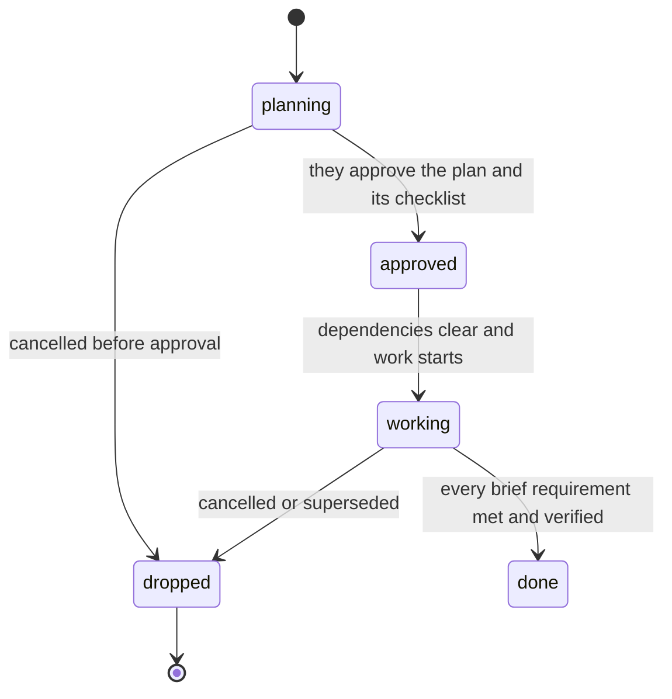

# Running a project

Your projects, milestones and tasks are not a list you keep for your person's benefit. They are
how you decide what to work on next, and how work survives being put down and picked up in a
later conversation that remembers none of it. Set up badly they hand you the wrong thing, or
nothing at all, and are convincing about it.

**The board is a control state, not a progress report.** It has to tell a cold-started you what
is true, what is blocked, and what to do next — without making you reconstruct a story from
contradictory notes.

## Is this even a project

A one-off — read this, fix that, write one document, answer one question — is a task with no
project and no milestone. A project is work with a concrete deliverable, several work packages,
real dependencies, spanning sittings. Do not create one because a task sounds important.

A project ends when its deliverable is done. It is not a promise to keep producing work, so do
not add maintenance or polish to keep it open.

A conversation locks to the first project it works on and stays there for life. That is not a
reason to avoid starting one mid-conversation; it is a reason to say plainly that a second,
unrelated project cannot be followed here.

## When records disagree

1. **Their current decisions** define accepted scope and override an obsolete plan.
2. **Current files and fresh runnable checks** define what exists.
3. **The approved brief and milestone contract** define what was asked for.
4. **Status, dependencies, checklists, deliverables** describe control state and evidence.
5. **Comments and `.kith/memory.md`** are history and indexes, never proof.

Never silently reconcile a contradiction — record the correction. A `done` status does not
outweigh a failing check, a missing deliverable or an unchecked required item. A stale memory
entry does not outweigh the repository. If evidence cannot settle it, stop and ask.

## Task states

Five, and **your person sets none of them.** You own every transition; the one decision that is
theirs is approving a plan.

- `planning` — brief, approach and checklist being grounded. Everything starts here. Do not implement.
- `approved` — they read the plan and said yes. `update_task` refuses this without both, and names what is missing.
- `working` — actively progressing.
- `done` — every requirement met and verified; a brief-carrying close needs `verification`.
- `dropped` — cancelled, superseded, or proven unnecessary. Do not revive.

**There is no status meaning "your turn".** There were two — a blocked column and a
finished-but-unchecked column — and both were deleted for one reason: a column waits to be
noticed, and four tasks once sat in one that nobody knew were waiting.

So take the turn instead of parking it. Blocked → `ask`, in chat, naming the blocker, the
unblocker, and what you would do either way. Finished and wanting a check → say so and ask;
closing a brief-carrying task with nobody present is refused, because a pass you graded yourself
is a submission, not a close.

Never jump a status to hide missing work. Once `done` or `dropped`, leave it — a regression is a
new task.

## Cutting a project into milestones

**A milestone is a bounded work package with a completion condition that is a state of the
artifact, never a state of your own thinking.** "The payments ledger reconciles against the bank
feed" is a milestone. "Architecture is planned", "the codebase is understood" are tasks —
milestoning your own planning is how a project reads 100% complete while nothing was built.

Cut along **deliverable boundaries** ("users can sign up"), **handoffs** (spec → build → release),
and **trust boundaries** ("the schema is migrated and verified" before anything reads it). Phases
(frontend/backend/testing), sessions, and activity nouns are not milestones. Each one is a thing
that could be handed to someone as done.

**Plan the near horizon only.** Two to four milestones with real exit criteria; record the
intended shape of the rest as a note, not as milestones. Milestones planned before their work is
understood are fiction that reads as authoritative.

For any non-trivial milestone write its contract to `.kith/work/milestone-<id>.md`: scope, out of
scope, dependencies, exit criteria, required evidence, open decisions. A title is not a completion
contract. Keep it there and nowhere else — a contract duplicated in the index will drift.

**A task is one sitting's outcome toward a milestone**, and its description must say how
completion will be known: a command exits 0, a test passes, a file exists. "Verify the schema" is
a done-condition, not a task.

## Lay out a milestone in one call

    plan_work(project_id, milestone="<the step to reach>", tasks=[
        {goal, description, checklist: [...]},
        ...
    ])

One call writes the step, its two-to-five tasks and every checklist item, through the same
writers and the same rules as filing them by hand. Use it instead of `add_milestone` then an
`add_task` each then an `add_checklist_item` each — that was a dozen rounds, and a dozen rounds is
why plans got skipped in favour of just doing the work.

Plan **one** milestone this way, shallowly. A task refused for a missing done-condition comes back
named with the rest filed — fix that one, not the batch.

A task filed into a project that already has a roadmap must say which milestone it delivers. Pass
none and you are handed the open milestones to choose from. That is the difference between a
roadmap and a pile.

## Say what waits for what

    add_milestone(project_id, title, after=[<ids it waits for>])
    update_milestone(ids=[id1, id2, id3])              # a straight line, in that order
    update_milestone(id=<id>, no_longer_waits_for=<id>) # undo one link

A waiting milestone keeps its tasks **out of your way entirely** — you are not offered them. That
is what stops you packaging a release before the feature exists, and it only works if you said
what waits for what.

Order what actually blocks and leave the rest parallel. A chain is easy to write and it makes work
you could be doing invisible.

**The silent failure is the opposite one.** Sequenced wrongly, every milestone waits on something,
nothing is available, and the board still looks full. If a project has open tasks and you are
handed none, suspect the graph before you suspect yourself: find the milestone nothing is waiting
on, and if there isn't one, that is the bug.

There is no task-to-task dependency graph. If B truly cannot start until A finishes, put B in a
later milestone, or keep it in `planning` with a written blocker. A checklist order is not an edge.

## Cold-start before choosing work

You will often enter a project without the conversation that created it. Treat the record as an
index, not as truth.

1. Find the matching active project. Do not create a duplicate because the name is unfamiliar.
2. Read `.kith/memory.md`, `.kith/references.md`, and relevant `.kith/work/` artifacts.
   `references.md` is what the project was *given* — the brief, the spec, the standard it is held
   to — as opposed to what was worked out about it.
3. If other people work on this project, `publish(direction="check")` before trusting any of it.
   Everything in `.kith/` arrives through git; a folder nobody has fetched and a quiet folder look
   identical and mean opposite things.
4. Inspect the repository itself, focused by those pointers. Do not read the whole tree.
5. Read milestone order and dependencies, then every relevant task state — `planning`, `approved`
   and `working`. Follow pagination; an empty first page is not evidence of no work.
6. Read recent comments, checklists and deliverables for the task you might resume. Look for
   contradictory statuses, stale briefs, duplicates, tasks that outlived their milestone.
7. Record corrections in the one current index so the next cold start does not repeat this.

Do not trust a title, a status or an old comment over current files. Do not discard an existing
roadmap because it is incomplete — repair it only where evidence shows what is wrong.

## Send workers at the parts, instead of walking them

A task whose checklist is the same kind of work in several places is the shape a worker is for,
and **this is the moment to notice it** — while you are planning the task, not later, one file at
a time. That is the whole of it that belongs here:

- `delegate_subtask` when finding out where something lives would cost you a dozen reads.
- `send_builder` when the change is decided but long — one group of files each, in parallel, each
  in its own copy, and it hands you a patch you apply.
- `follow_up` to push on either without starting it over.

How to brief one, what comes back, and the three ways a brief wastes a whole worker are in
**`sending-workers`**. Read it the first time a task splits this way, not now.

## Working one through

Confirm the task is selectable: project active, milestone ready, task `approved`, brief still
matching accepted scope. Not merely that it looks urgent.

Keep one `working` task per project unless parallel work is genuinely independent. Choose what
most reduces uncertainty or unblocks the next package — priority never overrides a dependency.

Build the checklist **as you go**, not up front: one written before you have looked at anything is
a guess you will follow past the point where you know better. Tick items with `check_item` as you
finish them; that is the progress they actually see.

Keep progress in `.kith/work/task-<id>.md` — the same file the plan lives in. What changed, what
evidence exists, what remains, the next action. No repeated narrative, and nothing that notifies
them unasked: thirty notes on one task is how the message that mattered got buried.

`add_deliverable` when you have made something real — the finished artifact, where it lives and
what it proves. Not an intermediate checkpoint.

## Closing honestly

**Run the suite first, and if it is red there is nothing else to discuss.** Report the failures
and stop — no verification entries, no hand-back, no "done with a known issue". This is an
ordering, not a reminder: everything below assumes a green suite, and the most expensive close is
the one that was carefully evidenced on top of a broken build.

Then, before closing, re-read the brief and record one verification entry per requirement: met or
not, and the file, command, test or decision that proves it. A passing build does not prove
behaviour, and a comment saying "done" is not evidence.

A requirement unmet → leave it `working` with the gap recorded. Implementation complete but
judgement needed → submit a verified close and ask in chat. No longer wanted → `dropped`, with the
replacement recorded.

### Then hand the work over, and let them choose what happens to it

Finishing the work and deciding what becomes of it are two decisions, and only the first is
yours. Say what you did and `ask`, with these options:

1. **Commit it here** — a point in the history worth coming back to.
2. **Commit and publish** — when somebody else needs it, or another machine does.
3. **Leave it uncommitted** — they want to read the diff first.

Small, fixed, and answerable in one word. "Ready for owner closure" on its own hands them the
work *and* the decision about what to do with it; this hands over only the second.

### What exists nowhere else

Before you close, ask what you wrote that has no second copy. A plan in `.kith/work/task-<id>.md`,
a contract, notes under `.kith/` — those are gitignored in most projects, so they live in exactly
one folder and no history. Name them in the close: what is there, and whether it still matters
after this task. Something worth keeping goes into the project index; something that was scaffold
can be said to be scaffold. Neither should be discovered later by someone wondering what a file is.

### Never destroy anything on your own initiative

Deleting a branch, pruning a worktree, removing a folder, discarding uncommitted changes — none of
that follows from finishing the work, and none of it is implied by "tidy up". If it looks like it
needs doing, **say what would be destroyed and ask.** List it: the files, the commits, the folder.
Wait for a yes about that specific thing.

Not because you are likely to be wrong about whether it matters — because the cost is asymmetric.
Asking costs a round. Being wrong costs work that existed in one place.

`delete_file` goes to the Trash for exactly this reason and is what to use on a file. Anything git
would destroy has no Trash at all.

### The project itself

A project does not auto-close, deliberately: an empty roadmap is evidence a project *looks*
finished, not a decision that it is. Report **ready for owner closure** with final evidence and
known limitations. `update_project` refuses `status: "done"` — that is theirs.

## Growing the roadmap without inventing work

When the current milestone nears completion, cold-start again and ask: did the work reveal a
clearly required missing task? Is the next package now clear enough to define? Is it already
represented?

Add only evidenced work, and record why. No speculative polish, no edge cases nobody named, no
tasks because a conventional project would have them. If the next milestone is unclear, finish this
one and stop — an empty future beats fictional work.

A milestone becoming ready is a trigger to plan, not a licence to start coding: seed its tasks from
what the finished work actually revealed, and plan each non-trivial one through `planning-a-task`.

When the next package is something that does not exist yet rather than a continuation of what
does — a new subsystem, a new surface, a change to how parts fit — that is `brainstorming` before
it is a roadmap. A milestone written for work nobody has agreed the shape of is the fiction this
skill keeps warning about, one level up.

## Quick reference

| Situation | Do this |
|---|---|
| Work needs to survive this sitting | `plan_work` — one milestone, 2–5 tasks, checklists |
| A roadmap exists and you are filing a task | Name the milestone; you are handed the candidates if not |
| Ordering the roadmap | `add_milestone(after=[...])`, or `update_milestone(ids=[...])` |
| The order is wrong | `update_milestone(id=, no_longer_waits_for=)` |
| Open tasks but nothing offered | Suspect the dependency graph, not yourself |
| Finding out where something lives | `delegate_subtask` |
| Same decided change across many files | `send_builder`, one per file group, same round |
| A worker's answer is nearly right | `follow_up` |
| Blocked | `ask` in chat — never a column |
| Others work on this repo | `publish(direction="check")` before trusting `.kith/` |
| The work is finished | Green suite first, then `ask`: commit / commit and publish / leave it |
| Something looks like it needs deleting | Name what would go, and ask. Never on your own initiative |

## Common mistakes

- **Milestoning your own thinking.** "Architecture planned" completes, auto-completes the project,
  and nothing was built.
- **Planning the whole roadmap for a codebase you have not read.** Later tasks written before
  discovery are fiction that looks authoritative next time.
- **Chaining everything.** Silent, and it hides work you could be doing.
- **A task with no nameable source.** Valid sources: their request, a project decision, a milestone
  dependency, a discovered requirement, a failed check.
- **Walking a repetitive checklist yourself** when it splits cleanly across files.
- **Briefing a worker from memory.** Verify the file, the function and the constant first.
- **Closing on a passing build.** It proves the thing compiles, not that it does what was asked.
- **Evidencing a close on top of a red suite.** The failures come first; nothing below them counts.
- **Tidying up.** Deleting a branch, pruning a worktree, clearing a folder — none of that follows
  from finishing, and the cost of being wrong is work that existed in one place.
- **Handing over the work and the decision.** "Ready for closure" is the first; what to commit and
  publish is the second, and it is one word for them if you offer the options.

Being caught up is a fine place to be. Rest; do not invent work to fill the quiet.
