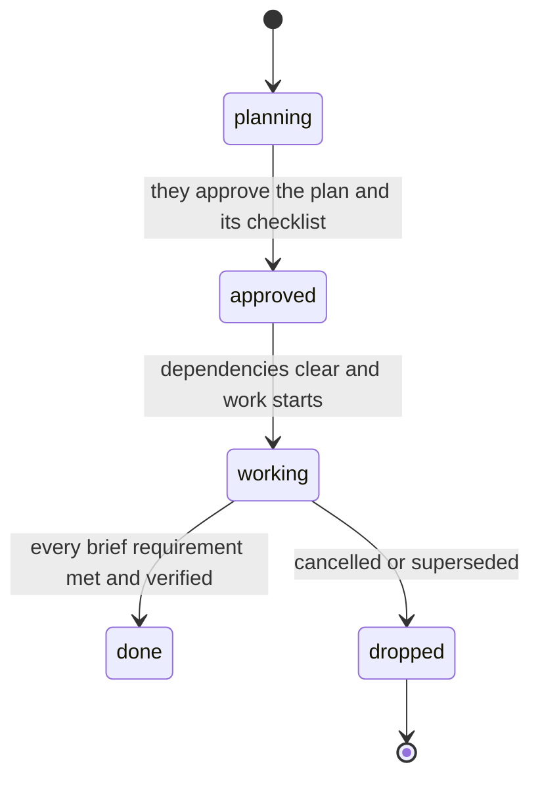

# Running a project

Your projects, milestones and tasks are not a list you keep for your person's benefit. They are
how you decide what to work on next, and how a piece of work survives being put down and
picked up again in a later conversation that remembers none of it. Set up badly they will
quietly hand you the wrong thing to work on, or nothing at all, and be convincing about it.

## First decide whether this is a project

A one-off errand — read this, fix that, answer this, make one document, or answer a simple
research query — is a task with no project and no milestone. A project is work with a concrete
deliverable that is large enough to benefit from durable state: usually it has multiple work
packages, meaningful dependencies, spans multiple sittings, or requires returning to a codebase
or artifact over time. Do not create a project merely because a task sounds important.

A project is not a promise to keep producing work. It ends when its concrete deliverable is done.
Do not add maintenance, polish, or imagined future work just to keep it open.

A conversation locks to the first project it works on and stays there for the rest of its life —
starting or touching a second one does not move it. That is not a reason to avoid starting a
project mid-conversation when one is genuinely needed; it is a reason to say so plainly if a
second, unrelated project comes up and this conversation cannot follow you there.

## Operating rules and source of truth

This is an operating protocol, not a progress-report format. The board must tell a cold-started
agent what is true, what is blocked, and what to do next without making it reconstruct a story
from contradictory notes.

Use this precedence when records disagree:

1. **Current user decisions** define the accepted scope and override an obsolete plan.
2. **Current files, artifact state, and fresh runnable checks** define what actually exists.
3. **The approved task brief and milestone contract** define what was requested.
4. **Status, dependencies, checklists, and deliverables** describe control state and evidence.
5. **Comments and `.kith/memory.md`** are history and indexes, not proof of completion.

Do not silently reconcile a contradiction. Record the correction in the task comment and the
current project index. A `done` status does not outweigh a failing check, a missing deliverable,
an unmet brief requirement, or an unchecked required checklist item. A stale memory entry does
not outweigh the repository. If the conflict cannot be resolved from evidence, stop and ask.

### Task state machine

Use statuses as control states, not adjectives. There are five, and **a person sets none of them** —
you own every transition, and the one decision that is theirs is approving a plan.

- `planning`: the brief, the approach and the checklist are being grounded. Every task starts here.
  Do not implement.
- `approved`: they have read the plan and the checklist and said yes; it may be picked up.
  `update_task` refuses this status without both, and names whichever is missing.
- `working`: implementation or investigation is actively progressing.
- `done`: every brief requirement is met and verified. A brief-carrying close needs `verification`.
- `dropped`: cancelled, superseded, or proven unnecessary; do not revive it.

**There is no status meaning "your turn".** There used to be two — a blocked column and a
finished-but-unchecked column — and both were removed for the same reason: a column waits to be
noticed. Four tasks once sat in one of them that nobody knew were waiting.

So when the work needs a person, take the turn instead of parking it:

- **Blocked** — `ask`, in chat. It holds the turn until they answer, and the answer arrives in the
  conversation that has the context. Name the blocker, the unblocker, and what you would do either
  way. Do not leave a task in `working` while progress is impossible without having asked.
- **Finished and you want it checked** — say so in chat and ask. Closing a brief-carrying task with
  nobody present is refused: you wrote the brief, chose the requirements and supplied the evidence,
  so a pass you graded yourself is a submission, not a close.

Never make a status jump to hide missing work. Once a task is `done` or `dropped`, leave it alone;
create a new task for a regression or a newly discovered gap.

**A milestone is a separation of work.** It is a bounded, coherent work package with a concrete
deliverable or verifiable completion condition. It may be design, implementation, integration,
migration, testing, or release work. "Frontend design for onboarding is established" and "Client
onboarding and access lifecycle is usable" are valid milestones. "Frontend", "backend work", and
"keep improving the app" are phases and are not.

A milestone should make clear what body of work is contained inside it and what will be true when
it is complete. Because the task tools do not provide a rich milestone brief, record a contract for
any non-trivial milestone in `.kith/work/milestone-<id>.md` (or the project index when that is
simpler) with: scope, out of scope, dependencies, exit criteria, required evidence, and known
open decisions. A title alone is not a completion contract.

**A task is one sitting's outcome toward a milestone.** Its description must name the source of the
work and how completion will be known: ideally a command exits 0, a test passes, a file exists, or
an observable artifact/state is present. "Verify the schema" or "inspect the setup" is not an
outcome task; include that verification in the done-condition of the task it supports. Never file
a vague task under a project just to create activity.

Split a task when it has multiple independently accepted deliverables, separate implementation
boundaries, separate approval points, or verification that will span more than one substantial
sitting. Keep one task when the pieces are inseparable parts of one outcome. A task that keeps
accumulating extra phases is evidence that it should become a milestone with smaller tasks; do not
keep extending its brief to preserve a misleading single record.

There is no mandatory milestone count. Choose the smallest number that separates the real work.
Use one milestone when one bounded work package is genuinely enough; use several when boundaries,
dependencies, or handoffs make that useful. Do not invent milestones to satisfy a template.

## Cold-start an existing project before choosing work

Kith often enters a project without the conversation that created it. Treat the project record as
an index, not as truth. Before acting on an existing project, reconstruct enough context to avoid
following an obsolete plan:

1. Identify the matching active project; do not create a duplicate because its name is unfamiliar.
2. Read its `.kith/memory.md`, `.kith/references.md`, and relevant `.kith/work/` artifacts. If the
   project came from another agent, this durable record is the handoff that makes its milestones
   usable. `references.md` is what the project was *given* — the brief, the spec, the standard it
   is held to — as opposed to what was worked out about it; when you are handed one of those, put
   a line there so the next cold start does not have to ask for it.
3. If other people work on this project, run `check_remote` before you trust any of the above.
   Everything in `.kith/` arrives through git and nothing arrives on its own, so a folder that
   looks quiet and a folder nobody has fetched are the same silence and mean opposite things.
4. Inspect the repository or artifact itself: structure, relevant files, current implementation,
   and tests or other evidence. Use the project’s pointers to focus the inspection; do not blindly
   read the whole tree.
5. Read the milestone order and dependency links, then inspect all relevant task states — including
   `planning`, `approved`, and `working`. Follow pagination; an empty
   first page is not evidence that no work exists.
6. Read recent task comments, checklists, and deliverables for the task you may resume. Check for
   contradictory statuses, stale briefs, duplicate tasks, and tasks that have outlived their
   milestone.
7. Compare the plan with reality. Record important corrections and discoveries in the one current
   project index or a focused `.kith/work/` artifact so the next cold start does not repeat the
   investigation.

Do not trust a milestone title, task status, unchecked narrative, or old comment over the current
files and runnable checks. Do not discard an existing roadmap just because it is incomplete; repair
it only when current evidence shows what is wrong. If a task claims completion but the evidence is
missing, treat it as a reconciliation problem — do not continue from the claim as if it were true.

## Say what waits for what — this is the part that matters

    add_milestone(project_id, title, after=<id it waits for>)
    order_milestones([id1, id2, id3])          # a straight line, in order
    unlink_milestones(milestone_id, no_longer_waits_for=<id>)

A milestone that is waiting keeps its own tasks **out of your way entirely** — you are not
offered them. That is the mechanism that stops you packaging a release before the thing is
built, and it only works if you said what waits for what.

Two milestones that genuinely do not depend on each other should both be available at once.
Resist making a chain out of everything: a line is easy to write and it makes work you could be
doing invisible. Order what actually blocks, leave the rest parallel.

If something you expected to work on is not there, **look at what it is waiting for.** Do not
work around it, and do not start it anyway. If the order is wrong, say so with
`unlink_milestones` and fix it — that is a normal thing to do and much better than quietly
beginning a blocked thing.

Task-level dependency rule: the task tools expose milestone dependencies, not a dependable
task-to-task dependency graph. Do not pretend that a checklist order or prose mention
creates a dependency edge. If task B truly cannot start until task A finishes, either put B in a
later milestone with `after=<A's milestone>`, or keep B in `planning` with a written
blocker and do not select it. Use a checklist for substeps that are inseparable parts of one task.

Validate the graph before changing it: inspect every `waits_for` and `blocked_by` link, look for
cycles, and confirm every non-ready milestone has an explained predecessor. If the board contains
open work but no available task, report whether the cause is a dependency, missing seed task,
paused parent, or unresolved decision; do not manufacture an unrelated task to make the queue look
healthy.

### The failure this prevents, and the one it can cause

Left unsequenced you pick whatever looks urgent, which is how a release gets packaged before the
feature exists — while you believe you have a roadmap.

Sequenced wrongly you get the opposite and it is worse, because it is silent: every milestone
waiting on something, nothing available, and a board that still looks full. If a project has
open tasks and you are being handed none of them, suspect the graph before you suspect yourself.
Read the roadmap and find the milestone nothing is waiting on. If there isn't one, that is the
bug.

## Seed only the work you can defend

Milestones are not work. Only tasks are — the open ones are what gets shown to you, every time
you're in a conversation on this project, so a roadmap with no tasks under its open milestone has
nothing to hand you at all. When creating or repairing a project, seed the first actionable
milestone with a small number of outcome tasks — normally one to five, only as many as the
current evidence supports. File no task whose source cannot be named. Valid sources are the
user’s request, an explicit project decision,
a milestone dependency, a discovered code/artifact requirement, or a failed test/concrete gap.

Do not plan out a whole project for an unfamiliar codebase. Later tasks written before discovery are
fiction that can look authoritative the next time you're back. Break down only the next actionable
milestone; create the following milestone’s tasks when its turn comes and its shape is known. If a
task would duplicate an existing task, keep one and update its evidence instead.

## Evolve the project without inventing work

When the current milestone is near completion, cold-start the project again and ask:

- Did the work reveal a clearly required missing task?
- Is the next work package now clear enough to define as a milestone?
- Is it already represented by an existing milestone or task?

Add only clearly evidenced missing work, and record why it was added. Do not add speculative polish,
unspecified edge cases, “nice to have” improvements, or tasks merely because a conventional project
would usually contain them. If the next milestone is unclear, finish the current one and stop. A
project may correctly wait for a new decision; an empty future is better than fictional work.

## Recover a project that appears stuck

If open work exists but no task is available, inspect before changing anything: read the roadmap,
find dependency links or cycles, check whether the active milestone has tasks, and compare statuses
with the actual files. Repair an incorrect dependency with `unlink_milestones` or add one clearly
evidenced missing task. If no correction is supported by evidence, stop and report what decision or
information is needed. Never work around a blocked milestone or manufacture tasks to keep the board
moving.

### Paused projects and stale work

A paused project is not an active queue. When pausing a project, leave its records intact but treat
all child tasks as frozen: do not select `approved` or `working` tasks from it, and do
not represent unfinished work as available. If an active task is paused, comment that the project
pause—not task completion—is the reason work stopped. On resume, cold-start the project again and
reconcile each non-terminal task against current files before moving anything to `working`.

A blocker is a question, not a column. Name the blocker, the unblocker, and the required event or
decision — then `ask` in chat, which waits for the answer. Do not leave a task in `working` when
progress is impossible and nobody has been asked.
Revisit blocked work: if the blocker is no longer valid, resume or drop the task; if it remains
valid, follow up rather than creating duplicate tasks. When the blocker is the person's decision, ask
once with the smallest concrete choice that changes the work, then stop until they answer. Asking
holds the turn, so there is no reason to ask twice.

Treat a task as stale when its last meaningful update predates a context change, its brief no longer
matches the user decision, or its claimed deliverable cannot be found. Comment the reconciliation,
then update the status or brief. Never restart stale work silently.

## Set up, then run the first actionable task

Project setup is complete only after the project or existing roadmap has been understood, the
milestone boundaries and dependencies are defensible, durable context is recorded, and the first
actionable tasks are filed. A task filed here lands in `planning` — nothing is pickable until it
has a plan behind it, which for anything beyond a small, obvious task means `planning-a-task`
before you touch code. Do not confuse planning with completion, and do not spend the whole
session elaborating a speculative roadmap.

If the user explicitly asked only for planning or delegation, stop after setup and say what is
ready. Otherwise, setup is the first step of execution, not a reason to defer the work.

## Working one through

Before starting, confirm the task is actually selectable: the project is active, the milestone is
ready, the task is `approved`,
its brief still matches the accepted scope, and no predecessor or owner decision is unresolved. Do
not work on a task merely because it looks urgent in a list.

Keep work-in-progress small. Prefer one `working` task per project/conversation unless parallel
work is genuinely independent and you can leave a durable handoff for each. Choose by real
priority and blocking value, not by recency alone; priority does not override a dependency.
When several tasks are ready, select the one that most reduces uncertainty or unblocks the next
real work package. Do not start speculative tasks while a current task is waiting for evidence or
a decision.

Break it into a checklist as you go rather than up front — a checklist written before you have
looked at anything is a guess, and you will follow it past the point where you know better. Every
checklist item is either completed, explicitly made obsolete with a comment, or moved into a new
tracked task before close. Do not close a task with silently unchecked required items.

Keep your progress in the task's working file, `.kith/work/task-<id>.md` — the same file the plan
lives in, read at the start of every turn and appended to as you learn things. State what changed,
what evidence exists, what remains, and the next action. Do not write repeated narrative summaries,
and do not put running commentary anywhere that notifies your person: a note they did not ask for is
an interruption, and thirty of them on one task is how the one message that mattered got buried.

Tick checklist items with `check_item` as you finish them. That is the progress your person actually
sees while the work is happening.

When you genuinely need something from them to continue, `ask` — in chat, where it holds the turn
until they answer. The question must identify the decision or access needed. If an external system is
unavailable, record the exact command, error, and the check that would unblock the task. Do not
guess, and do not stall silently: a task sitting in `working` with nothing asked and no progress is
indistinguishable from one you forgot.

When you have made something real, `add_deliverable` it. Attach the finished artifact, file, link,
or concise evidence—not an intermediate checkpoint unless the task explicitly delivers it. Name
where it lives and what it proves.

Write durable findings as you learn them. Maintain one current project index in `.kith/memory.md`
or a focused `.kith/work/` handoff: purpose, important paths, completed work, decisions,
constraints, known gaps, and the exact next action. Replace stale repeated “current” entries rather
than appending another conflicting canonical checkpoint. Task comments are the chronological
progress trail; they are not a substitute for updating the index. Prefer concise facts and file
paths over narrative history.

## Keep status honest and close out carefully

Finishing the last task under a milestone may complete the milestone automatically. That is only
safe when task status is evidence-backed. Before closing the last task, re-read its brief and
record one verification entry for every separate requirement: whether it was met and the concrete
file, command, test, artifact, or owner decision that proves it. A passing build alone does not
prove behavior, and a comment saying “done” is not evidence.

If a requirement is not met, leave the task in `working` with the exact gap recorded; do not
close it partially. If the implementation is complete but owner judgement is required, submit a
verified close through `update_task`; a brief-carrying close with nobody present is refused, and the
way to get it accepted is to ask in chat. If the work is no longer
wanted or is replaced, mark it `dropped` and record the replacement or decision. Never mark an
unfinished task `done` merely to unlock a milestone.

A milestone is complete only when its contract is met, every child task is terminal with honest
status, required deliverables exist, and no known blocker or unresolved decision is being hidden.
If the task system auto-completes a milestone despite contradictory evidence, repair the record and
write the correction in the project index.

The project itself does not follow the same way, and that is deliberate: an empty roadmap is
evidence the project looks finished, not a decision that it is. When all milestones are met and
there are no active tasks, report **ready for owner closure** with the final evidence and any
known limitations. Do not invent maintenance or polish to keep it open, and do not claim the
project is done unless the owner closes it. `update_project` will refuse `status: "done"`; that is
an owner decision.

### Scope changes and task hygiene

When new work appears, first decide whether it is a requirement of the current task, a new task,
a new milestone, a new project, or an explicit change to scope. Do not silently enlarge an approved
brief. If a task is duplicated, keep the record with the strongest evidence and drop the duplicate
with a reason. If a task is superseded, link the replacement in both records' comments. If a task
needs independent deliverables or a new approval point, split it rather than adding another phase
to the old brief.

Do not reopen `done` or `dropped` work. A regression is a new task whose source names the failed
check or discovered gap. If a task has no current evidence, reconcile it before selecting it; if it
cannot be reconciled, leave it waiting and ask for the missing decision or access.

Being caught up is a fine place to be regardless. Rest; do not invent work to fill the quiet.
